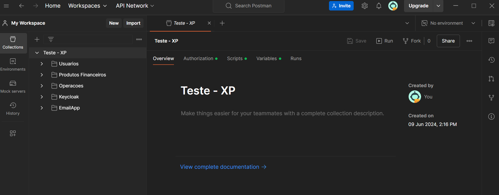

# TesteXP
Repositorio Destinado a implementação do teste para XP

<hr />


#### Execução da aplicação

*   Na raiz do diretório, executar o comando abaixo para iniciar a aplicação:
* **Versão Docker - (26.1.3)**, **Versão Docker Compose - (1.29.2)**

 ```bash
    docker-compose up -d
 ```

 * Para verificar o status de cada um dos componentes relacionados a aplicação, use o comando:

 ```bash
    docker-compose ps
 ```

 

 * Quando todos os componentes estiverem com status "Up", a aplicação pode estará pronta para testes.

 <hr />

 #### Estrutura da aplicação
  
  * A solução do projeto segue a seguinte estrutura: <br />
  

  <br />

  * A pasta de solução "EmailApp" guarda todo o codigo para execução da aplicação para envio de emails.
   
  <br />

  * A pasta de soluçao "MainApp" é guarda o código voltado ao escopo de usuários, produtos financeiros, compra, venda e consulta de extrato.

<hr />

#### Estrutura do ecosistema
  
  * Para execução da aplicação em questão, o uso de alguns componentes de infraestrutura são necessários, para armazenamento de dados foi usado o SGBD <b>Mysql</b>, e para autenticação/autorização foi usado o <b>Keycloak</b>, o desenho e implementação do docker-compose segue abaixo:
  
  

  ```yaml
  version: "3.9"

    services:
    testexp:
        depends_on:
        - keycloak
        restart: unless-stopped
        container_name: testexp
        network_mode: "host"
        build:
        dockerfile: TesteXP.Dockerfile
        context: ./
    
    rw_email:
        container_name: rw_email
        network_mode: "host"
        build:
        dockerfile: RW_Email.Dockerfile
        context: ./
        restart: unless-stopped

    mysql_xp:
        container_name: mysql_xp
        image: mysql
        volumes:
        - ./db:/docker-entrypoint-initdb.d
        ports:
        - 3306:3306
        environment:
        MYSQL_ROOT_PASSWORD: "root!"
        restart: unless-stopped

    keycloak:
        container_name: keycloak
        image: quay.io/keycloak/keycloak:legacy
        environment:
            DB_VENDOR: MYSQL
            DB_ADDR: mysql_xp
            DB_DATABASE: keycloak
            DB_USER: root
            DB_PASSWORD: root!
            KEYCLOAK_USER: admin
            KEYCLOAK_PASSWORD: admin
            PROXY_ADDRESS_FORWARDING: 'true'
        depends_on:
            - mysql_xp
        ports:
            - "4000:8080"
        volumes:
        - ./wait-for-it.sh:/wait-for-it.sh
        entrypoint: ["/wait-for-it.sh", "mysql_xp:3306", "--timeout=120", "--", "sh", "-c", "/opt/jboss/tools/docker-entrypoint.sh"]
        restart: unless-stopped

    networks: 
    default: 
        name: xp-nt
  ```

#### Como usar a aplicação

  * Na raiz do repositório existe uma collection postman para importação e consumo dos endpoints implementados na aplicação, as urls, um usuário padrão e um script para alimentação automático do token já estão implementados nessa collection, para confirmar, após a importação da collection, navegue até o menu scripts e variables do postman:




#### Endpoints:
* **Endpoints de usuários**:
<b>POST - /usuarios</b> - Cadastra um novo usuário
<br /><b>GET - /usuarios</b> - Consulta todos os usuários
<br /><b>PATCH - /usuarios/inativar/{idUsuario}</b> - Consulta todos os usuários

<br />

Obs: Ao cadastrar um usuário via API, os usuários serão sincronizados com o keycloak via rotina uma assíncrona que roda de 10 em 10 segundos.

Ao inativar um usuário, ele será removido do keycloak para que um novo token de accesso não seja mais criado

<b>Exemplo do keycloak (Realm XP - Todos os usuarios):</b>


<b>Exemplo do keycloak (Realm XP - pós inativação usuário 2):</b>


* **Execução**:

<b>Cadastro</b>


<b>Consulta</b>


<b>Inativação</b>


<hr />

* **Endpoints de produtos financeiros**:
<b>PATCH - /Produto/disponivel/true/{idProdutoFinanceiro}</b> - Atualiza se um produto deve estar disponivel ou não para venda
<br /><b>PATCH - /Produto/inativar/{idProdutoFinanceiro}</b> - Inativa um produto financeiro
<br /><b>PATCH - /Produto/ativar/{idProdutoFinanceiro}</b> - Ativa um produto financeiro
<br /><b>POST - /Produto</b> - Cadastra um novo produto financeiro
<br /><b>PUT - /Produto</b> - Atualiza um produto financeiro
<br /><b>GET - /Produto</b> - Consulta os produtos disponiveis para venda
<br /><b>GET - /Produto/{idProdutoFinanceiro}</b> - Consulta um produto financeiro por id
<br /><b>GET - /Produto/todos</b> - Consulta todos os produtos independente de status ou disponibilidade para venda

<br />

* **Execução**:
<br />

**Cadastro**


* O campo **Rendimento Diário** é um parametro de configuração usado pelo endpoint **/Operacao/fake** para simular um rendimento dos produtos.
* O campo **Valor** representa o valor inicial do produto.
* O campo **Data vencimento** é somente usado pela rotina que notifica os administradores, mas não implica em nenhuma restrição para consuta, compra ou venda de produtos.

**Consulta disponiveis pra venda**


<hr />

* **Endpoints de operações**:
<b>POST - /Operacao/fake</b> - Simula rendimento alimentando o extrato para todos os produtos cadastrados
<br /><b>POST - /Operacao/comprar/{idProdutoFinanceiro}</b> - Registra a compra de um produto financeiro disponivel para venda
<br /><b>GET - /Produto/extrato</b> - Consulta o extrato de todos os produtos de um investidor, traz os ultimos 20 registros de extrato
<br /><b>GET - /Produto/meus_produtos</b> - Retornar todos os produtos financeiros de um investidor

* **Execução**:
<br />

**Compra**

Consultando o extrato do usuario "Pedro Rocha", vemos que ele ja tem um saldo positivo, pois ja vendeu produtos, mas no momenton não possui nenhum produto financeiro comprado:


Vamos comprar o novo produto cadastrado, o produto 3:


Mesmo após a compra, o produto não aparece no extrato, pois ainda não teve rendimentos, mas é possível confirmarmos a compra, pelo endpoint que lista todos os produtos de um investidor:

##### **Extrato**


##### **Listagem de produtos de um investidor**


Vamos agora chamar o endpoint **/Operacao/fake** para simularmos um rendimento para o produto 3, podemos chamar o endpoint 2 vezes para vermos a evolução de rendimento no extrato.


E agora, podemos chamar o endpoint de extrato e acompanhar a evolução do produto:


Os registros no array **"historicoRendimento"** está ordenado de forma decrescente, então olhando o ulitmo registro, podemos ver o valor inicial do produto no campo **"valorAnterior"**, o mesmo valor que usamos ao cadastrar esse produto, mas também podemos ver o valor de redimento, que foi de 50%, e podemos acompanhar a progressão desse rendimento no registro acima, cujo valor anterior foi atualizado e o valor de seu rendimento acompanha o registro.

Podemos ver também o total de rendimento do produto desde o seu cadastro com o campo **"mensagem"**, e o valor atual do produto no campo **"valorAtual"**

<hr />

#### Pontos de atenção

* **Aplicação para disparo de email**
A aplicação RW_Email, que é responsável por enviar emails através de uma integração com o serviço da Sendgrid, precisa de uma chave para funcionar corretamente. A chave deve ser posta no appsettings da aplicação, presente no caminho relativo a este README.md (src\RW_Email.Api\appsettings.json):


* Realizei um teste com uma chave e este foi o resultado:
  


Obs: por questão de configurações do sendgrid, não pude usar o dominio do appsettings **(no-reply@teste_xp.com.br)**

* **Aplicação para disparo de email**
  
Os containeres do ecosistema já irão configurados com o dump da minha base local após os testes de validação da aplicação, o dump está na pasta db/dump.sql dentro deste repo, o dump também contempla a configuração da base do keycloak, neste mesmo repo também está presente a configuração importavel do realm do keycloak no formato json (**realm-export.json**). O dump deve ser importado automaticamente ao subir o container do mysql.